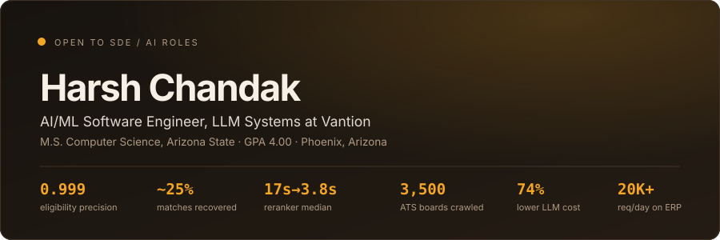

<picture>
  <source media="(prefers-color-scheme: dark)" srcset="assets/header-dark.svg">
  <source media="(prefers-color-scheme: light)" srcset="assets/header-light.svg">
  
</picture>

I work on LLM systems where being wrong is expensive.

Most of it is unglamorous. Writing the harness before the feature. Keying a scoring path on an integer instead of a UUID because the reply was output-token-bound. Finding the canonicalization bug that had been hiding a quarter of the eligible matches for months, while the tests stayed green.

---

### Now

**Vantion** · Walnutech · AI/ML Software Engineer Intern, LLM Systems · May 2026 to now

I own matching: which scholarships a student is actually eligible for, and in what order.

|  |  |
| --- | --- |
| `0.999` | precision on eligibility across `1,382` awards, after replacing an LLM judge with a rules engine |
| `~25%` | of eligible matches were hidden by a canonicalization bug, across `320` scholarships, fixed with zero regressions |
| `17s → 3.8s` | reranker median, by keying the scoring path on an integer index instead of a UUID |
| `6.3s → 0.15s` | repeat match requests, which now make zero LLM calls |
| `40,000+` | scholarships, extraction cost halved by batching pages under one prompt |

Small team, so the surface is wide. I also isolated the parallel LangGraph advisors, because one crashing agent was taking a student's whole chat turn with it. Moved background jobs onto a durable Postgres queue after deploys kept silently killing them. Made the student app work on a phone in a `79`-file change. Closed source.

Python · TypeScript · LangGraph · RAG · hybrid search · prompt caching · Postgres · pgvector · Redis · FastAPI · Next.js

---

### Built

| | |
| --- | --- |
| **[job-market-crawler](https://github.com/harsh-chandak/job-market-crawler)** | `3,500` ATS boards polled directly, `86%` of `1M+` polls skipped as unchanged, duplicates collapsed, everything ranked before a model is called. Cut LLM cost per document `74%`. |
| **[trustmed](https://github.com/harsh-chandak/trustmed)** | Drug knowledge assistant. Rasa and Neo4j, answering ingredient, generic and substitute questions by traversing a graph instead of matching text. |
| **[zk-coldchain](https://github.com/harsh-chandak/zk-coldchain)** | Zero-knowledge proof that a shipment broke its temperature limit, without revealing the log. Circom and Solidity, with automatic payout. |
| **[data-vis](https://github.com/harsh-chandak/data-vis)** | Linked D3 views over accident data. [Live](https://data-vis-0eqs.onrender.com/) |
| **[krr-project](https://github.com/harsh-chandak/krr-project)** | Multi-robot warehouse planning in answer-set programming. [Live](https://krr-project.onrender.com) |

---

### Before

**Arizona State University** · Software Engineer, AI Systems and Data Infrastructure · Aug 2025 to May 2026 · part-time alongside the M.S.

Built a `200`-input scoring harness first, then halved candidates per input while malformed outputs fell `~20%`. A LangGraph and WhisperX pipeline over `10K+` audio inputs. Telemetry ingestion at `2K+` events a day with idempotency and backpressure, P95 down `~45%`.

**Neuromonk Infotech** · Software Engineer, Full-Stack and Product · Jan 2023 to May 2024

Owned four ERP modules used by `70+` manufacturing clients at `20K+` API requests a day. Rebuilt the accounting model for interstate GST; errors hit zero. Dashboards from `4-5s` to under `2s`. Live schema migrations in reversible stages, zero downtime, for clients whose factory floors run on the ERP.

---

### Rest

M.S. Computer Science, Arizona State, `4.00` · B.Tech Computer Engineering, Pune University, `8.52`

Python · TypeScript · SQL · FastAPI · Node · React · Postgres · Redis · Neo4j · pgvector · Kafka · AWS · Docker · Kubernetes · LangGraph · RAG · hybrid search

Phoenix, Arizona. Open to SDE and AI roles.

[harsh-chandak.com](https://harsh-chandak.com) · [LinkedIn](https://linkedin.com/in/hnchandak) · harshnchandak@gmail.com
